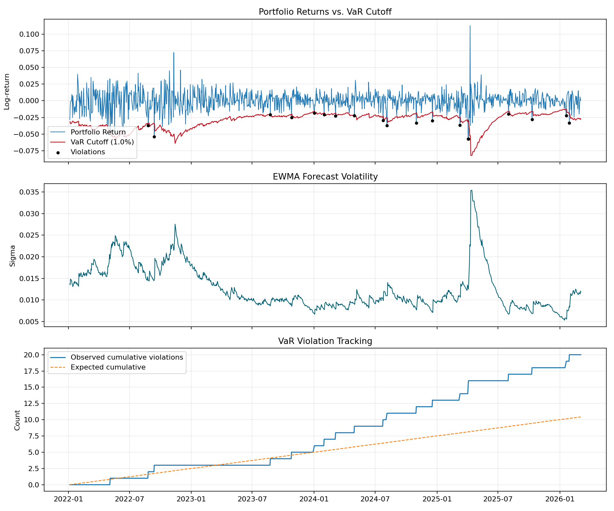
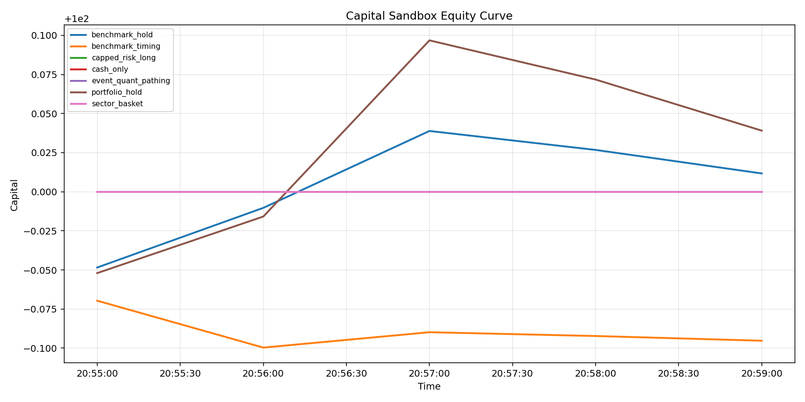

# Results Overview

This page is the shortest evidence summary for the repo.

## Current State

What is already true:

- the risk engine is implemented
- the news engine is implemented
- the fusion layer is implemented
- grouped backtests, calibration lineage, ops analytics, and the sandbox are implemented

What is **not** yet true:

- the guarded integrated map does not yet beat the pure baseline end-to-end in grouped aggregate backtests

That is the main unresolved research gap.

## Main Takeaways

The strongest current claims are:

1. fresh and delayed provider flows are both working
2. `replay_as_of_timestamp` allows time-shifted testing without using future information
3. the guarded map improves specific probe batches
4. the guarded map still has a promotion gap versus the pure baseline in grouped aggregate research

## Showcase Outputs

### Baseline Quant Risk

This is the plain risk baseline:

- returns
- volatility
- VaR line
- violations

### Replay As-Of Example

This is a time-shifted replay using:

- as-of: `2026-03-05T19:04:00-03:00`
- provider: `NewsAPI.org`
- strategy: `delayed`

The point is not that this one window is decisive.  
The point is that the replay is rigorous: it only uses information available up to that cutoff.

## Best Evidence Files

Best first reads:

1. `showcase/probe_compare_report.md`
2. `showcase/capital_replay_asof_1904.md`
3. `showcase/capital_replay_batch_report.md`
4. `showcase/operator_summary.md`
5. `showcase/ops_analytics_report.md`

## Interpretation

The repo currently supports three levels of conclusion:

### Strong conclusions

- the system architecture works
- the multi-provider pipeline works
- deterministic event processing works
- grouped research backtests work
- time-shifted replay works

### Moderate conclusions

- the guarded map helps in some probe batches and specific event families
- the provider strategy split between fresh and delayed windows is useful

### Still-open conclusions

- whether the guarded integrated map deserves final promotion over the pure baseline
- whether the richer sandbox paths fire often enough on truly fresh actionable signal

## Practical Reading

If you want to understand the evidence in order:

1. [Showcase Walkthrough](showcase_walkthrough.md)
2. [Backtest Research](backtest_research.md)
3. [Ops Validation](ops_validation.md)
4. [Reading Order](reading_order.md)
